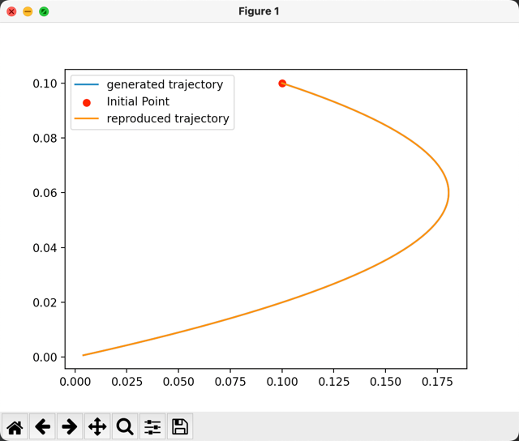

# lacy_linear_system
This python function is an implementation of the following paper: https://ieeexplore.ieee.org/abstract/document/1211226

This program could learn matrix A and lyapunov parameter P from data.

The demo could be found at the bottom of linear_ds_opt

## Function Explanation

```
generate_ds(A_matrix, init_point, dt, 51, 0, [], 0)
```
To generate a trajectory by A matrix, you should specify these parameters:
* Target Matrix A (continuous linear system)
* initial point
* integration time
* integration step

The Last Three parameters are:
```
do_plot, A_rep, rep_plot
```
* do_plot: will plot generated trajectory
* A_rep and rep_plot:
  * if you passed learned A and set rep_plot to 1, it will plot reproduced trajectory


